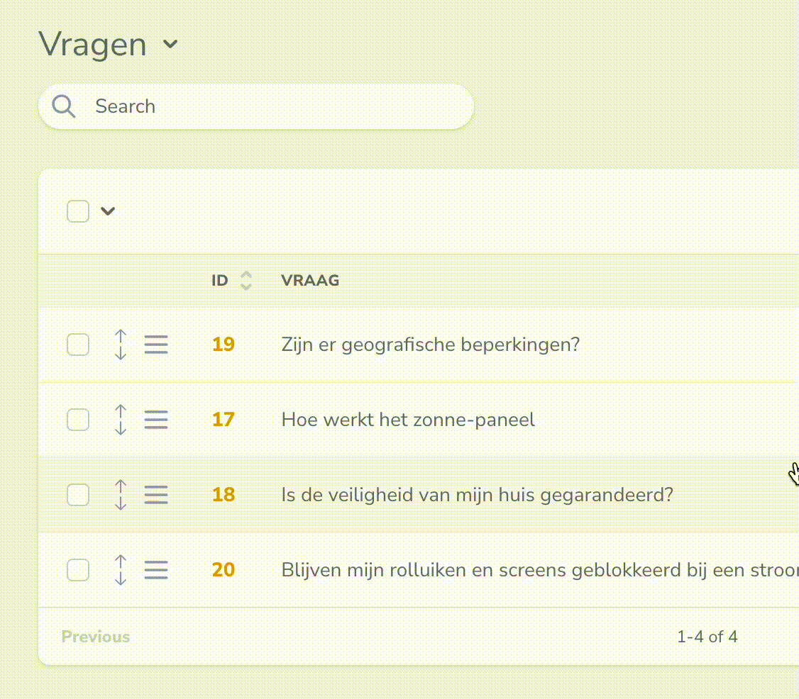

# Nova Sortable

[](https://packagist.org/packages/marshmallow/nova-resource-click)
[](https://packagist.org/packages/marshmallow/nova-resource-click)

This [Laravel Nova](https://nova.laravel.com) package allows you to define the click action on a Nova resource's index row.

## Requirements

- `php: >=8.0`
- `laravel/nova: ^4.0`

## Features

- Define the action of the click on the index page of the Resource Table row

## Screenshots



## Installation

Install the package in a Laravel Nova project via Composer:

```bash
# Install package
composer require marshmallow/nova-resource-click
```

## Config

Publish the config file with

```bash
php artisan vendor:publish --provider="Marshmallow\NovaResourceClick\ToolServiceProvider" --tag="config"
```

This is the default content of the config file:

```php

  return [

      /**
       * Default action for all resources when click is applied;
       */
      'default' => 'view',
  ];

```

## Usage

When the resource does not have a click action configuratored, the default action will be used: 'view' .

Note: This package extends the default `TableResourceRow` component from Laravel Nova. Any other package that overwrites this component may cause this package to break.

### Add the row click action to Nova resource

To apply the 'clickAction' on the individual Resource by adding the `HasClickAction` trait and adding the `$clickAction` variable.

```php

use Marshmallow\NovaResourceClick\Traits\HasClickAction;

class MyResource extends Resource
{
  use HasClickAction;

  public static $clickAction = 'update';  // Options: view, update, select, ignore

  ...
}
```

Or by using use the `additionalInformation` feature:

```php

class MyResource extends Resource
{

  /**
   * Get meta information about this resource for client side consumption.
   *
   * @param  \Illuminate\Http\Request  $request
   * @return array<string, mixed>
   */
  public static function additionalInformation(Request $request)
  {
    return [
        'clickAction' => 'update' // Options: view, update, select, ignore
    ];
  }

  ...
}
```

## Credits

- [Lars Kort](https://github.com/ltkort)

## License

Nova Resource Click is open-sourced software licensed under the [MIT license](LICENSE.md).
